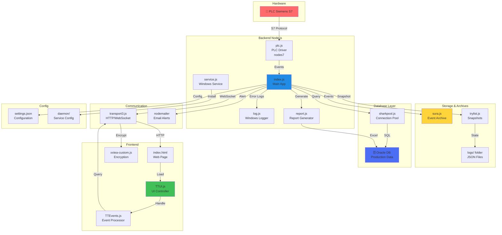

# TaktTime-Andon - Documentação do Projeto

## 📋 Visão Geral

O **TaktTime-Andon** é um sistema de monitoramento de produção em tempo real desenvolvido para a fábrica Perkins em Curitiba, Brasil. O sistema funciona como um **Andon Digital** que monitora:
- Tempo Takt (ritmo de produção)
- Paradas de produção
- Turno de trabalho
- Integrações com PLCs (Controladores Lógicos Programáveis)
- Banco de dados Oracle
- Interface Web em tempo real

## 🏗️ Diagrama da Arquitetura



---

## 📁 Estrutura de Pastas e Arquivos

### 🔴 **Raiz do Projeto**

#### `index.js`
- **Função**: Arquivo principal da aplicação
- **Descrição**: Inicia o servidor Node.js, carrega todas as dependências e módulos (PLC, banco de dados, transporte, email)
- **Responsabilidades**:
  - Gerenciamento de erros global (SIGINT, uncaughtException, unhandledRejection)
  - Inicialização de pool de conexões de banco de dados (Oracle)
  - Integração com PLC via Siemens S7
  - Gerenciamento de eventos (SURA)
  - Sistema de alertas por email
  - Queries SQL pré-configuradas para eventos, turnos, pausas, planos e feriados

#### `log.js`
- **Função**: Sistema de log estruturado
- **Descrição**: Gerencia logs de erro em Windows usando Event Logger
- **Características**:
  - Usa `node-windows` para integração com Windows Event Viewer
  - Três níveis de log: info (1), warn (2), error (3)
  - Limite configurável de exceções
  - Período de contagem de erros

#### `service.js`
- **Função**: Instalador do serviço Windows
- **Descrição**: Permite instalação/desinstalação como serviço Windows
- **Comandos**:
  - `node service.js install` - Instala o serviço
  - `node service.js uninstall` - Remove o serviço
- **Configuração**:
  - Nome: "Perkins TaktTime 2"
  - Descrição: "Andon system for Perkins Curitiba, Brasil facility"
  - Alocação de memória: 4GB máximo

#### `report.js`
- **Função**: Gerador de relatórios
- **Descrição**: Cria relatórios de produção e exporta dados
- **Relacionado**: `report.json` (cache de configurações)

#### `settings.json`
- **Função**: Arquivo de configuração central
- **Descrição**: Define todos os parâmetros do sistema
- **Configurações principais**:
  - `port`: 8080 - Porta HTTP
  - `logging`: false - Ativar/desativar logs
  - `DBLogOnline`: true - Conectar ao banco de dados
  - `SMTPOnline`: true - Enviar emails
  - `PLCOnline`: true - Conectar ao PLC
  - `productionOnline`: true - Monitora dados de produção
  - Timeouts e retry policies para banco de dados
  - Número máximo de conexões (10)

#### `takttime.bat`
- **Função**: Script de inicialização em lote
- **Descrição**: Arquivo batch para executar a aplicação via Windows
- **Uso**: Início rápido do sistema

---

### 📂 **Pasta `/html/` - Interface Web Frontend**

Contém a interface web de usuário em tempo real.

#### `index.html`
- **Função**: Página principal da aplicação web
- **Descrição**: Template HTML que carrega a interface Andon

#### `TTUI.js`
- **Função**: UI Controller - Lógica da interface de usuário
- **Descrição**: Framework JavaScript que gerencia:
  - Telas de dashboard
  - Entrada de dados de usuário
  - Formatação de horários e turnos
  - Estados da aplicação (caches)
  - Eventos de timeout inativo
- **Características**:
  - Suporta múltiplos turnos e tipos de parada
  - Tela de boas-vindas (Welcome Screen)
  - Timeouts de inatividade (10 minutos)
  - Armazenamento de caches locais

#### `TTEvents.js`
- **Função**: Gerenciador de eventos do frontend
- **Descrição**: Processa eventos em tempo real da aplicação
- **Uso**: Comunicação entre UI e servidor

#### `TTUI.css`
- **Função**: Folha de estilos principal
- **Descrição**: Estilos CSS para a interface Andon

#### `transport3.js`
- **Função**: Camada de transporte HTTP/WebSocket
- **Descrição**: Gerencia comunicação cliente-servidor
- **Recursos**:
  - Requisições HTTP seguras
  - Criptografia/descriptografia (XXTEA)
  - Cache de dados
- **Arquivo backup**: `transport3 - backup 2025-07-18.js`

#### `xxtea-custom.js`
- **Função**: Biblioteca de criptografia customizada
- **Descrição**: Implementação do algoritmo XXTEA para criptografia simples

#### `sha-512.js`
- **Função**: Hash seguro SHA-512
- **Descrição**: Implementação de hashing para segurança

#### `TEXT-portugese.js`
- **Função**: Dicionário de textos em Português
- **Descrição**: Strings de interface em português brasileiro

#### `manifest.json`
- **Função**: Manifest PWA
- **Descrição**: Configuração de Progressive Web App

#### `empty.html`
- **Função**: Página vazia
- **Descrição**: Template HTML minimalista, possivelmente para testes

#### 📁 **`/html/images/`**
Armazena recursos visuais da interface:
- **`icons/`**: Ícones da aplicação

#### 📁 **`/html/old/`**
Versões antigas e backups:
- `transport3 - Copy.js` - Cópia de transporte
- `transport3.js.bak.txt` - Backup de texto
- `TTUI - Copy.js` - Cópias antigas da UI
- `backup July 25/` - Backup completo

---

### ⚙️ **Pasta `/daemon/` - Configuração do Daemon/Serviço**

Arquivos de configuração para executar como serviço Windows.

#### `perkinstakttime2.exe.config`
- **Função**: Arquivo de configuração do executável
- **Descrição**: Configurações .NET para o executável do daemon

#### `perkinstakttime2.xml`
- **Função**: Configuração XML do serviço
- **Descrição**: Define parâmetros do serviço Windows

---

### 🗄️ **Pasta `/instantclient_18_5/` - Cliente Oracle**

Contém a biblioteca Oracle Instant Client v18.5.

#### `BASIC_LICENSE`
- Arquivo de licença do Oracle Instant Client

#### `BASIC_README`
- Documentação do cliente Oracle

#### 📁 **`/vc14/`**
- Componentes Visual C++ necessários para o cliente

---

### 🔧 **Pasta `/plc/` - Integração com PLC**

Gerencia comunicação com controladores lógicos programáveis Siemens.

#### `plc.js`
- **Função**: Driver de PLC
- **Descrição**: Gerencia conexão e comunicação com PLCs Siemens S7
- **Recursos**:
  - Suporte a múltiplas estações
  - Mapeamento de endereços de memória
  - Sistema de retry automático
  - Callback para eventos de conexão
- **Dependência**: Usa pacote `nodes7` (Siemens S7 protocol)

#### `package.json`
- Dependências do módulo PLC

#### `plc - Copy.js`
- Backup do arquivo principal

---

### 💾 **Pasta `/sharkpool/` - Pool de Conexões DB**

Gerenciador de conexões de banco de dados.

#### `sharkpool.js`
- **Função**: Connection Pool Manager
- **Descrição**: Gerencia pool de conexões MySQL/Database
- **Características**:
  - Suporte a múltiplos tipos de banco de dados
  - Fila de queries com timeout
  - Tratamento inteligente de erros
  - Retry automático
  - Alocação eficiente de recursos
- **Configurações**:
  - Máximo de conexões
  - Timeout de execução

#### `package.json`
- Dependências (mysql2)

#### `test.js`
- Testes do módulo sharkpool

#### `sharkpool_bak.js`
- Backup do módulo

---

### 🗃️ **Pasta `/sura/` - Event Archive System**

Sistema de arquivo para eventos estruturado.

#### `sura.js`
- **Função**: Source Unified Readable Archive
- **Descrição**: Sistema de arquivo estruturado para eventos com compressão
- **Características**:
  - Escrita eficiente de eventos
  - Leitura rápida com cache (1MB)
  - Organização por dias
  - Metadados estruturados
  - IDs únicos para cada evento
- **Estrutura**:
  - Bytes de seek: 5
  - Bytes de ID: 13
  - Limite máximo: 99.999 registros
  - Extensão: `.log`

#### `package.json`
- Dependências do módulo

#### `test.js`
- Testes do SURA

#### `sura.js`
- Implementação principal

---

### 📊 **Pasta `/trylist/` - Sistema de Tentativas e Snapshots**

Gerencia tentativas de operações com snapshots.

#### `trylist.js`
- **Função**: Retry e Snapshot Manager
- **Descrição**: Sistema de retry para operações com snapshots periódicos
- **Características**:
  - Snapshots de estado (15 segundos de delay)
  - Limpeza periódica (10 minutos)
  - Log de tentativas
  - Limite de 10 snapshots padrão
  - Período de snapshot: 2 minutos padrão
- **Estrutura**:
  - Pasta `snapshots/`: Armazena snapshots
  - Pasta `logs/`: Armazena logs
  - Extensão: `.json` e `.log`

#### `package.json`
- Dependências

#### `test.js`
- Testes do módulo

#### `_trylist.js` e `trylist_old.js`
- Versões antigas

---

### 🧲 **Pasta `/sunk/` - Sistema de Sincronização**

Gerencia sincronização de dados entre sistemas.

#### `sunk.js`
- **Função**: Sincronizador de dados
- **Descrição**: Sincroniza dados entre múltiplos sistemas ou banco de dados
- **Uso**: Manter consistência entre source e target

#### `package.json`
- Dependências

#### `test.js`
- Testes

#### `sunk_bak.js`
- Backup

---

### 📈 **Pasta `/reports/` - Relatórios e Modelos**

Armazena templates de relatórios e arquivos históricos.

#### `Report_Template_31.xlsm`
#### `Report_Template_32.xlsm`
#### `Report_Template_33.xlsm`
- **Função**: Templates de relatórios Excel macros
- **Descrição**: Modelos para geração de relatórios de produção em Excel

#### 📁 **`/reports/archive/`**
- **Função**: Arquivo de relatórios históricos
- **Descrição**: Relatórios gerados anteriormente (2020-12-xx)
- **Padrão de nomenclatura**: `YYYY-MM-DD_HH-MM-YYYY-MM-DD_HH-MM-{timestamp}-{id}.xlsm`
- **Quantidade**: Centenas de relatórios históricos

---

### 📂 **Pasta `/old/` - Arquivos Antigos e Backups**

Contém versões antigas do projeto.

#### `index - Copy.js`
- Cópia antiga do index.js

#### `index_bak.js`
- Backup do arquivo principal

#### 📁 **`/old/backup 2021-07-25/`**
- Backup completo de 2021-07-25
- Contém: `index.js`, `report.js`, `report.json`

#### 📁 **`/old/backup July 25/`**
- Backup mais recente
- Contém múltiplas variações de index, report e settings

#### 📁 **`/old/backup July 31/`**
- Backup de 31 de julho

#### 📁 **`/old/logs - Copy/`**
- Cópias de arquivos de log JSON
- Exemplos: `1607350938041-perkins.json`

---

## 🔗 Fluxo de Dados Principal

```
PLC (Siemens S7)
    ↓
plc.js (nodes7)
    ↓
index.js (main app)
    ↓ (events)
sura.js (archive)
EVENT (event storage)
    ↓
sharkpool.js (connection pool)
    ↓
Oracle Database
    ↓
report.js (reports)
    ↓
HTML/TTUI.js (web interface)
    ↓
Browser (index.html + transport3.js)
```

---

## 🔌 Dependências Principais

| Módulo | Função |
|--------|--------|
| `nodes7` | Comunicação com PLCs Siemens S7 |
| `mysql2` | Driver MySQL |
| `oracledb` | Driver Oracle |
| `nodemailer` | Envio de emails |
| `node-windows` | Integração Windows Service |
| `xxtea-custom` | Criptografia de transporte |
| `sha-512` | Hash seguro |

---

## ⚙️ Configurações Críticas (settings.json)

- **DB**: Oracle Database com pool de 10 conexões
- **PLC**: Siemens S7 com protocolo nodes7
- **Email**: Alertas via SMTP
- **Web**: Interface em porta 8080
- **Timeouts**: Configuráveis por operação
- **Retry**: Backoff inteligente com divisor de 8

---

## 🚀 Inicialização

```bash
# Como serviço
node service.js install
net start "Perkins TaktTime 2"

# Manual
node index.js

# Via batch
takttime.bat
```

---

## 📝 Logs e Eventos

- **Armazenamento**: Pasta `logs/` com format JSON
- **Sistema**: Windows Event Logger (via log.js)
- **Eventos**: SURA (Source Unified Readable Archive)
- **Snapshots**: trylist.js (até 10 snapshots por tentativa)

---

## 🔐 Segurança

- Criptografia XXTEA para transporte
- SHA-512 para hashing
- Validação de certificados HTTPS
- Hash expiry: 60 segundos
- Blacklist timeout: 3 segundos

---

**Última Atualização**: 2026
**Sistema**: Perkins TaktTime Andon
**Local**: Curitiba, Brasil
