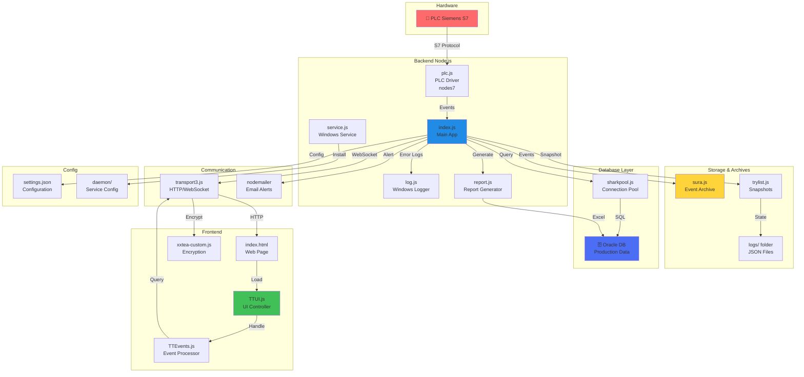

# 🏗️ Arquitetura do Sistema TaktTime-Andon

## Diagrama Técnico

## 📋 Legenda

- **🔧 Hardware**: Equipamentos físicos
- **🟦 Backend**: Lógica de servidor (Node.js)
- **💾 Storage**: Armazenamento de eventos
- **🗄️ Database**: Persistência em Oracle
- **📡 Communication**: Transporte de dados
- **🌐 Frontend**: Interface web
- **⚙️ Config**: Configurações do sistema

## 🔄 Fluxo Principal

1. **PLC Siemens S7** → Envia eventos via protocolo S7
2. **plc.js** → Recebe e processa
3. **index.js** → Orquestra todo o sistema
4. **Persistência** → SURA (arquivo) + Oracle (DB)
5. **Relatórios** → report.js gera Excel
6. **Transport** → WebSocket com criptografia XZTEA
7. **Frontend** → TTUI.js renderiza interface
8. **Alertas** → Email via SMTP

---

**Para visualizar este diagrama:**
- Abra este arquivo no VS Code com a extensão Mermaid
- Pressione `Ctrl+Shift+V` para preview
- Ou acesse https://mermaid.live/ e cole o código
